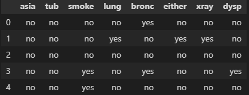
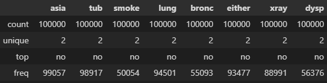
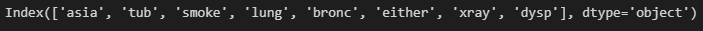

# Taller 9

### Aprendizaje en Redes Bayesianas: Estructura

##### Analítica Computacional para la Toma de Decisiones

---

|     Nombres      |      Apellidos       |     Login     |  Codigo   |
| :--------------: | :------------------: | :-----------: | :-------: |
|     Santiago     | Gonzalez Montealegre | s.gonzalez35  | 202012274 |
| Juliana Carolina |  Cardenas Barragan   | jc.cardenasb1 | 202011683 |

---

---

## Pre-requisitos

---

1. Asegúrese de tener instalado Python en versión 3.7 o superior.

1. Para este taller usaremos Python y en particular la librería `pgmpy`. Instale `pgmpy` con el comando

   ```py
   pip install pgmpy
   ```

   o si prefiere repositorios de anaconda use

   ```py
   conda install -c ankurankan pgmpy
   ```

   También puede usar el administrador de paquetes de Anaconda.

1. La entrega de este taller consiste en un reporte y unos archivos de soporte. Cree el archivo de su reporte como un documento de texto en el que pueda fácilmente incorporar capturas de pantalla, textos y similares. Puede ser un archivo de word, libre office, markdown, entre otros.

1. En su reporte incluya las respuestas solicitadas en el taller, marcando la sección y el numeral al que se refieren.

1. Sus archivos de soporte deben ser scripts de python (.py) o cuadernos de Jupyter (ipynb).

---

---

## Estimando la estructura de un modelo a partir de datos: restricciones

---

### 1.

Considere los datos `data_asia.csv`, adjunto a este taller. Usando `pandas`, cargue los datos (modifique la ubicación del archivo), elimine la columna extra inicial, revise las primeras filas de los datos, genere una descripción inicial e imprima las columnas que permanecen.

```py
import pandas as pd

df = pd.read_csv("C:\\path\\to\\data_asia.csv")
df = df.drop("Unnamed: 0", axis = 1 )
print(df.head())
print(df.describe())
print(df.columns)
```

Incluya el resultado en su reporte.







---

### 2.

Usando `pgmpy` estime la estructura del modelo usando el método de restricciones.

```py
from pgmpy.estimators import PC
est = PC(data=df)

estimated_model = est.estimate(variant="stable", max_cond_vars=4)
print(estimated_model)
print(estimated_model.nodes())
print(estimated_model.edges())
```

En su reporte incluya el resultado y explique qué quiere decir el segundo argumento del método `estimate`.

Grafique el modelo resultante.

---

### 3.

Convierta el objeto `DAG` obtenido con el anterior procedimiento a una red bayesiana y use el estimador de máxima verosimilitud para estimar los parámetros de la red.

```py
from pgmpy.models import BayesianNetwork
from pgmpy.estimators import MaximumLikelihoodEstimator

estimated_model = BayesianNetwork(estimated_model)
estimated_model.fit(data=df, estimator = MaximumLikelihoodEstimator)

for i in estimated_model.nodes():
    print(estimated_model.get_cpds(i))
```

Incluya y comente el resultado en su reporte.

---

---

## Estimando la estructura de un modelo a partir de datos: Puntajes

---

### 1.

En un nuevo archivo, repita los pasos de la sección anterior, pero ahora realice la estimación de la estructura usando un método búsqueda de estructura usando el método de búsqueda `Hill Climbing` y el `puntaje K2`.

El código para la estimación de la estructura sería algo así

```py
from pgmpy.estimators import HillClimbSearch
from pgmpy.estimators import K2Score

scoring_method = K2Score(data=df)
esth = HillClimbSearch(data=df)
estimated_modelh = esth.estimate(
    scoring_method=scoring_method,
    max_indegree=4,
    max_iter=int(1e4)
    )

print(estimated_modelh)
print(estimated_modelh.nodes())
print(estimated_modelh.edges())
```

En su reporte incluya el resultado y comente qué hacen los argumentos `max_indegree` y `max_iter`.

Grafique el modelo resultante.

---

### 2.

Imprima el resultado del puntaje obtenido.

```py
print(scoring_method.score(estimated_modelh))
```

En su reporte comente qué es este puntaje.

---

### 3.

Repita el procedimiento anterior usando el punta `BIC`, al cual puede acceder en el módulo estimators.

```py
from pgmpy.estimators import BicScore
```

Estime la nueva estructura, grafíquela y comente el resultado en su reporte.

---

---

## Ahora con Otra Red y Datos

---

En este paso, usaremos unos datos y una propuesta de análisis de Lorenzo Mario Amorosa. Los datos son del Banco Mundial, se resumen a continuación

```py
Pop  = Population growth (annual %)
Urb  = Urban population growth (annual %)
GDP  = GDP per capita growth (annual %)
EC   = Energy use (kg of oil equivalent per capita) - [annual growth %]
FFEC = Fossil fuel energy consumption (% of total) - [annual growth %]
REC  = Renewable energy consumption (% of total final energy consumption) - [annual growth %]
EI   = Energy imports, net (% of energy use) - [annual growth %]
CO2  = CO2 emissions (metric tons per capita) - [annual growth %]
CH4  = Methane emissions in energy sector (thousand metric tons of CO2 equivalent) - [annual growth %]
N2O  = Nitrous oxide emissions in energy sector (thousand metric tons of CO2 equivalent) - [annual growth %]
```

---

### 1.

Inicie cargando los datos (adjuntos a este taller) y aplicando la función annual_growth para generar el dataframe que será el centro de análisis.

```py
from pandas import read_csv, DataFrame
import numpy as np

def annual_growth(row, years):
    min_year = years["min"]
    max_year = years["max"]
    row["Indicator Name"] = row["Indicator Name"] + " - [annual growth %]"
    for year in range(max_year, min_year, -1):
        if not np.isnan(row[str(year)]) and not np.isnan(row[str(year - 1)]):
            row[str(year)] = 100 * (float(row[str(year)]) - float(row[str(year - 1)])) / abs(float(row[str(year - 1)]))
        else:
            row[str(year)] = np.nan
            row[str(min_year)] = np.nan
    return row

years = {"min" : 1960, "max" : 2019}
df_raw = read_csv("C:\\path\\to\\italy-raw-data.csv")
df_raw_growth = DataFrame(data=[row if "growth" in row["Indicator Name"] else annual_growth(row, years) for index, row in df_raw.iterrows()])

print("There are " + str(df_raw_growth.shape[0]) + " indicators in the dataframe.")
print(df_raw_growth.head())
```

En su reporte describa los datos crudos y los datos obtenidos con la transformación.

---

### 2.

Extraiga algunas de las columnas/variables/características para análisis.

```py
nodes = ['Pop', 'Urb', 'GDP', 'EC', 'FFEC', 'REC', 'EI', 'CO2', 'CH4', 'N2O']
df_growth = df_raw_growth.transpose().iloc[4:]
df_growth.columns = nodes
print(df_growth.head(10))
```

---

### 3.

Transforme las variables de la siguiente manera

```py
TIERS_NUM = 3

def boundary_str(start, end, tier):
    return f'{tier}: {start:+0,.2f} to {end:+0,.2f}'

def relabel_value(v, boundaries):
    if v >= boundaries[0][0] and v <= boundaries[0][1]:
        return boundary_str(boundaries[0][0], boundaries[0][1], tier='A')
    elif v >= boundaries[1][0] and v <= boundaries[1][1]:
        return boundary_str(boundaries[1][0], boundaries[1][1], tier='B')
    elif v >= boundaries[2][0] and v <= boundaries[2][1]:
        return boundary_str(boundaries[2][0], boundaries[2][1], tier='C')
    else:
        return np.nan

def relabel(values, boundaries):
    result = []
    for v in values:
        result.append(relabel_value(v, boundaries))
    return result

def get_boundaries(tiers):
    prev_tier = tiers[0]
    boundaries = [(prev_tier[0], prev_tier[prev_tier.shape[0] - 1])]
    for index, tier in enumerate(tiers):
        if index is not 0:
            boundaries.append((prev_tier[prev_tier.shape[0] - 1], tier[tier.shape[0] - 1]))
            prev_tier = tier
    return boundaries

new_columns = {}
for i, content in enumerate(df_growth.items()):
    (label, series) = content
    values = np.sort(np.array([x for x in series.tolist() if not np.isnan(x)] , dtype=float))
    if values.shape[0] < TIERS_NUM:
        print(f'Error: there are not enough data for label {label}')
        break
    boundaries = get_boundaries(tiers=np.array_split(values, TIERS_NUM))
    new_columns[label] = relabel(series.tolist(), boundaries)

df = DataFrame(data=new_columns)
df.columns = nodes
df.index = range(years["min"], years["max"] + 1)

print(df.head(10))
```

En su reporte comente en qué consiste esta transformación.

---

### 4.

Estime la estructura del modelo usando el método por restricciones. En su reporte incluya el modelo y comente los resultados.

---

### 4.

Estime la estructura del modelo usando el método por puntaje. En su reporte incluya el modelo y comente los resultados.

---

### 4.

Lorenzo propuso el siguiente modelo

```py
model = BayesianModel([
    ('Pop', 'EC'),
    ('Urb', 'EC'),
    ('GDP', 'EC'),
    ('EC', 'FFEC'),
    ('EC', 'REC'),
    ('EC', 'EI'),
    ('REC', 'CO2'),
    ('REC', 'CH4'),
    ('REC', 'N2O'),
    ('FFEC', 'CO2'),
    ('FFEC', 'CH4'),
    ('FFEC', 'N2O'),
    ])
```

En su reporte compare este modelo con los que obtuvo en los numerales anteriores.
